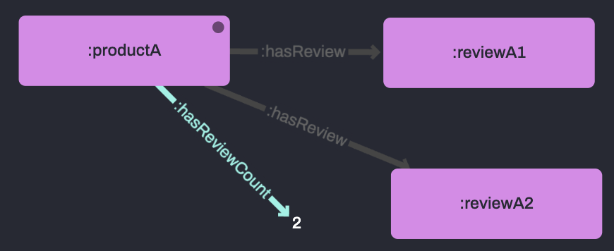

# 2.1 Aggregation

<br>

## 🔥 &nbsp; Why is Aggregation helpful?

Want to calculate the sum total of a property or count the number of objects in a class?

Aggregation is the key!

For example, how many reviews does each of my products have? What is their average star rating?

<br>
<br>

## 📖 &nbsp; What is Aggregation?

Aggregates calculate sums, averages and other functions over a set of results. 

Aggregate functions such as SUM and COUNT take a sample of data and use it to perform a calculation.

The aggregate are often performed for each member of a group, resulting in the total SUM or COUNT calculated per member.

As well as these widely applicable aggregates, RDFox also offers more specialized functions like COUNT_MAX(V) and MAX_ARGMIN(A,V).

See the more about [the available Datalog aggregates here](https://docs.oxfordsemantic.tech/reasoning.html#aggregate-syntax).

<br>
<br>

## ⚡ &nbsp; Real world applications

COUNT and SUM are so versatile that they can be used in almost any application, with other functions supporting increasingly targeted and powerful goals.

<br>

### Retail

To quantify and analyze user behavior, quantify and rank product sentiment, etc.

<br>

### Finance

To sum transactional amounts, isolate extreme values and outliers, validate complex regulation compliance, etc.

<br>

### Construction & Manufacturing

To surface and compare high-level compound properties, formulate a cost sheet, etc.

<br>
<br>

## 🔬 &nbsp; Example



The following rule performs a count of reviews per product, adding the result to the graph.

```
[?product, :hasReviewCount, ?reviewCount] :-
    AGGREGATE (
        [?product, :hasReview, ?review]
        ON ?product
        BIND COUNT(?review) AS ?reviewCount
    ).
```

Here is the data we'll be using to show this:

```
:productA :hasReview :reviewA1 ;
    :hasReview :reviewA2 .

:productB :hasReview :reviewB1 ;
```
<br>
<br>

## ℹ️ &nbsp; Syntax helper

To use aggregation in a rule, you must declare an aggregate atom in the rule body with `AGGREGATE()`.

The parenthesis `()` of the aggregate atom must contain all the relevant triple atoms.

When grouping the aggregate into sub-sets, you must also indicate which variable(s) you're aggregating on with `ON` (known as group variables), and bind the result to a new variable with `BIND`.

<br>
<br>

## ✅ &nbsp; Check the results

Run `2_1-Aggregation/example/exScript.rdfox` to see the results of this rule.

<br>

### You should see...

|=== Number of reviews per product ===||
|-----------|-------------|
|:productA| 2| 
|:productB| 1| 

<br>
<br>

## 🔍 &nbsp; Variable scope

Variables in aggregate atoms are local to the atom unless they unless they are group variables (in the `ON` statement).

Therefore, two aggregates can use a variable with the same name so long as it is not a mentioned group variable.

<br>
<br>

## 🚀 &nbsp; Exercise

Complete the rule `2_1-Aggregation/incompleteRules.dlog` to create 'Star Products' - that is, products with a **higher than 4 star average** rating AND **more than 5 total reviews**.

Here is a representative sample of the data in `2_1-Aggregation/exercise/data.ttl`.

```
:product0001 a :Sofa ;
    :hasReview :review11.

:review11 :hasStars 5 .
```

<br>
<br>

## 📌 &nbsp; Hints & helpful resources

[Aggregate functions in RDFox](https://docs.oxfordsemantic.tech/querying.html#aggregate-functions)

<br>
<br>

## ✅ &nbsp; Check your answers

Run the script below to verify the results.

`2_1-Aggregation/exercise/script.rdfox`

<br>

### You should see...

**========================= Our Star Products =========================**
|?starProduct|?averageStars|	?reviewCount|
|-----------|-------------|-------------|
|:product0579|	4.5|	8|
|:product0934|	4.5|	6|
|:product0395|	4.428571428571428571|	7|
|:product0209|	4.375|	8|
|:product0317|	4.285714285714285714|	7|
|:product0222|	4.166666666666666667|	6|
|:product0931|	4.142857142857142857|	7|
|:product0492|	4.142857142857142857|	7|
|:product0137|	4.142857142857142857|	7|
|:product0326|	4.125|	8|

<br>

### Visualise the results

Open this query in the [RDFox Explorer](http://localhost:12110/console/datastores/explore?datastore=default&query=SELECT%20%3FstarProduct%20%3FaverageStars%20%3FreviewCount%0AWHERE%20%7B%0A%20%20%20%20%3FstarProduct%20a%20%3AStarProduct%20%3B%0A%20%20%20%20%3AhasAverageStars%20%3FaverageStars%20%3B%0A%20%20%20%20%3AhasReviewCount%20%3FreviewCount%20.%0A%7D%20ORDER%20BY%20DESC%28%3FaverageStars%29).

<br>
<br>

## 👏 &nbsp; Bonus exercise

Write a new rule that uses `MAX(V)` and `COUNT_MAX(V)` to find the highest rated review for each product, and return the number of reviews that share that rating.

Write a query [in the console](http://localhost:12110/console/datastores/sparql?datastore=default) to validate you work.

Discuss your solutions with others in the `RDFox-Workshop` channel of our [Slack Community](https://join.slack.com/t/rdfox/shared_invite/zt-1z7dnm2ad-WoKRf~~3CynB_KTi5X0RHg)!
