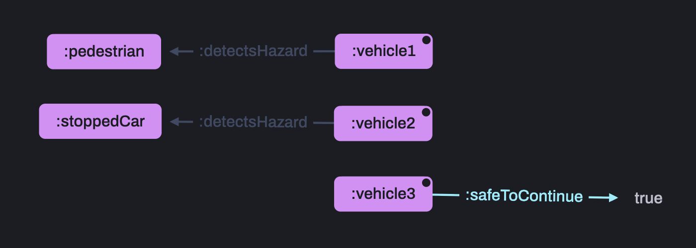
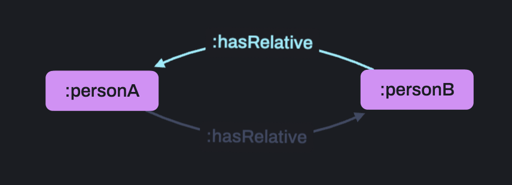

# 2.2 Negation as Failure


## 🔥 &nbsp; Why is Negation as Failure helpful?

Have you ever needed to act on information that was false or missing?

Negation is the solution!

For example, does this autonomous-vehicle see any hazards? If not, it's safe to proceed.

<br>
<br>

## 📖 &nbsp; What is Negation as Failure?


<br>
<br>

Negation as Failure (NAF) filters results based on the absence of some particular information from the data - inferring new facts where a pattern is false or missing.

Treating missing information as false is known as the Closed World Assumption.

<br>
<br>

## ⚡ &nbsp; Real world applications

Negation as failure is a particularly powerful tool as the absence of data is a common concept in real-world applications.

<br>

### On-device

To encode real-world decision-making rules, map dependencies, repair data, etc.

<br>

### Publishing

To generate advanced recommendations, offer detailed search, control user access, etc.

<br>

### Construction and Manufacturing

To determine complex compatibilities, comply with schematics and regulations, simulate failure conditions, etc.

<br>
<br>

## 🔬 &nbsp; Example


<br>
<br>
The following rule checks to see whether a vehicle's onboard sensors have detected a red light and, if not, allows the vehicle to continue moving.

```
[?vehicle, :safeToContinue, true] :-
    [?vehicle, a, :Vehicle] ,
    NOT ( 
        [?vehicle, :detectsLight, :red]
    ) .
```

Here is the data we'll be using to show this:

```
:vehicle1 a :Vehicle ;
    :detectsLight :red .

:vehicle2 a :Vehicle ;
    :detectsLight :green .

:vehicle3 a :Vehicle .
```

<br>
<br>

## ✅ &nbsp; Check the results

Run `2_2-NegationAsFailure/example/exScript.rdfox` to see the results of this rule.

<br>

### You should see...

=== Vehicles that may continue to move ===

:vehicle2
<br>
:vehicle3

<br>
<br>

## ℹ️ &nbsp; Syntax helper

Notice that vehicle 3 is allows to continue due to the closed world assumption.

Negation atoms must be accompanied by at least one non-negation atom directly in the rule body (excluding atoms within the negation atom itself), as is shown above.

In the case that the pattern is matched, this ensures that at least one variable is bound.

<br>
<br>

## 🔍 &nbsp; NOT EXISTS

**NOT** is often used in combination **EXISTS** as it allows us to introduce a new variable, or variables, that are not bound in the wider rule body.

This opens up the possibility for more general negation patterns to be included.

## 🔬 &nbsp; Example


<br>
<br>
The following rule checks to see whether a vehicle's onboard sensors have detected **any hazard** and, if not, allows the vehicle to continue moving.

```
[?vehicle, :safeToContinue, true] :-
    [?vehicle, a, :Vehicle] ,
    NOT EXISTS ?hazard IN (
        [?vehicle, :detectsHazard, ?hazard ]
    ) .
```

Here is the data we'll be using to show this:

```
:vehicle1 a :Vehicle ;
    :detectsHazard :pedestrian .

:vehicle2 a :Vehicle ;
    :detectsHazard :stoppedCar .

:vehicle3 a :Vehicle .
```

<br>
<br>

## ✅ &nbsp; Check the results

Run `2_2-NegationAsFailure/example2/exScript.rdfox` to see the results of this rule.

<br>

### You should see...

=== Vehicles that may continue to move ===

:vehicle3

<br>
<br>

## 🔍 &nbsp; Variable scope

Variables introduced by NOT EXISTS remain unbound when the rule-body infers new facts as the patterns don't exist.

Therefore, the scope of these variables must be local to the negation atom. They can share the names of a variables in the wider body without sharing a binding.

<br>
<br>

## ℹ️ &nbsp; Incremental Retraction

Negation remains consistent even when new data means old facts are no longer true.

For example, if vehicle3 detects a hazard, the fact `:vehicle3 :safeToContinue true` will be retracted.

In the following script we'll add this data to show Incremental Retraction in action:

```
:vehicle3 :detectsHazard :stoppedCar .
```

<br>
<br>

## ✅ &nbsp; Check the results

Ensuring that you have run the scripts above...

now run `2_2-NegationAsFailure/example3/exScript.rdfox` to add the new data and run the same query.

<br>

### You should see...

=== Vehicles that may continue to move ===

*0 results*

This is because `:vehicle3 :safeToContinue true` has now been retracted - it no longer exists in our store.

<br>
<br>

## 🔍 &nbsp; Reasoning cycles

With Negation and Aggregation, it is possible to create infinite reasoning cycles.

While some types of cycles are allowed and are in fact incredibly useful (see 3.3), rules sets cannot be imported if the cycles they create involve Negation or Aggregation as they lead to inferred facts being updated with every iteration. 

Take the following rule as an example.

```
[?vehicle, :hasState, "Warning - No State Available"] :-
    [?vehicle, a, :Vehicle] ,
    NOT EXISTS ?state IN (
        [?vehicle, :hasState, ?state] 
    ).
```

1. If a vehicle **has no state**, a **new state is inferred**, showing 'Warning - No State Available'.
2. However, now this vehicle **does have a state** ('Warning - No State Available'), so it's **no longer true that is has no state**, meaning 'Warning - No State Available' will be **retracted**.
3. But now, as it has no state, the rule matches again and infers 'Warning - No State Available' and so on...

RDFox will reject any rule that behaves like this.

<br>
<br>

## 🚫 &nbsp; Check the error

Run `2_2-NegationAsFailure/example4/exScript.rdfox` to see the error created by this rule.

<br>

### You should see...

```
An error occurred while executing the command:
    The program is not stratified because these components of the dependency graph contain cycles through negation and/or aggregation:
    ======== COMPONENT 1 ========
        <https://rdfox.com/example#hasState>[?vehicle, "Warning - No State Available"] :- <https://rdfox.com/example#Vehicle>[?vehicle], NOT EXISTS ?state IN <https://rdfox.com/example#hasState>[?vehicle, ?state] .
    ========================================================================================================================
```

## ℹ️ &nbsp; Stratification Errors and conditions

This is known as a **stratification error**.

**Strata**, also called **components**, can be thought of as the 'layers' of logic that support an inferred fact.

An error occurs when the strata don't create stable facts (facts that don't change unless other data is changed).

This can only happen when a set of rules contains either negation or aggregation.

In the example above, the rule creates a fact, then removed it on the next 'cycle', so the rule **cannot** be stratified.

When cycles don't change facts, like the examples below, they **can** be stratified:

1. While the logic is cyclic, facts will not be changed in each iteration.

    ```
    [?y, :hasRelative, ?x] :-
        [?x, :hasRelative, ?y] .
    ```
    
<br>
<br>
2. While this rule creates an infinite loop, it doesn't update facts as it goes, instead it adds a new fact each iteration with a progressively higher count, leaving a trail of all the counts up until that point.

    ```
    [?x, :hasCount, ?newCount] :-
        [?x, :hasCount, ?count],
        BIND (?count + 1 AS ?newCount) .
    ```
    
<br>
<br>
    \* This is a fabricated view representing the steps taken by the reasoning engine but cannot actually be visualised as the reasoning must first terminate, which an infinite rule would not do.

<br>

### What to do when encountering a stratification error?

RDFox will tell you which rule set caused a stratification error to occur.

This rule set will include either:

1. A rule with a negation atom in the body

2. A rule with an aggregate atom in the body

One of these 'special relationships' will be creating a cycle that you must remove.

Sometimes, the self-referential behavior is required, so we must use a workaround - separating the special relationship from the cyclic part.

Let's complicate our example above to demonstrate this clearly. These rules cannot be stratified:

```
[?vehicle, :hasState, "Warning"]  :-
    [?vehicle, :hasWarning, "No State Available"] .

[?vehicle, :hasWarning, "No State Available"] :-
    [?vehicle, a, :Vehicle] ,
    NOT EXISTS ?state IN (
        [?vehicle, :hasState, ?state] 
    ).
```

To stratify these rules and achieve the desired output, we simply need to remove the special relationship from the cycle.

We do this by introducing a new proxy-relationship as follows:

```
[?vehicle, :hasProxyState, ?state]  :-
    [?vehicle, :hasState, ?state] .

[?vehicle, :hasProxyState, "Warning"]  :-
    [?vehicle, :hasWarning, "No State Available"] .

[?vehicle, :hasWarning, "No State Available"] :-
    [?vehicle, a, :Vehicle] ,
    NOT EXISTS ?state IN (
        [?vehicle, :hasState, ?state] 
    ).
```

<br>
<br>

## 🚀 &nbsp; Exercise

Complete the rule set `2_2-NegationAsFailure/incompleteRules.dlog` to indicate whether the vehicle is safe to turn left or right, or stop at any given time.

Here is a representative sample of the data in `2_2-NegationAsFailure/exercise/data.ttl`.

```
:sensorF a :PrimaryCamera ;
    :supportsManeuver :moveForward .

:vehicle a :Vehicle ;
    :hasState :vehicleState1.

:vehicleState1 a :VehicleState ;
    :hasTimeStamp "2025-01-01T12:00:01"^^xsd:dateTime ;
    :hasSensorReading :reading1-1.

:reading1-1 a :SensorReading ;
    :fromSensor :sensorF ;
    :detectsHazard :pedestrian.
```

<br>
<br>

## 📌 &nbsp; Hints & helpful resources

See the [Negation](https://docs.oxfordsemantic.tech/reasoning.html#negation-syntax) page in the docs for help.

<br>
<br>

## ✅ &nbsp; Check your answers

Run the script below to verify the results.

`2_2-NegationAsFailure/exercise/Script.rdfox`

<br>

### You should see...

================== Safe Maneuvers =================

|?timeStamp|?safeManeuver|
|-----------|-------------|
|"2025-01-01T12:00:01"^^xsd:dateTime | :leftTurn |
|"2025-01-01T12:00:02"^^xsd:dateTime | :stop |
|"2025-01-01T12:00:03"^^xsd:dateTime | :rightTurn |
|"2025-01-01T12:00:04"^^xsd:dateTime | :rightTurn |
|"2025-01-01T12:00:05"^^xsd:dateTime | :stop |
|"2025-01-01T12:00:06"^^xsd:dateTime | :rightTurn |
|"2025-01-01T12:00:07"^^xsd:dateTime | :rightTurn |
|"2025-01-01T12:00:08"^^xsd:dateTime | :rightTurn |
|"2025-01-01T12:00:09"^^xsd:dateTime | :rightTurn |
|"2025-01-01T12:00:10"^^xsd:dateTime | :leftTurn |

<br>
<br>

## 👏 &nbsp; Bonus exercise

Write a new rule that, when combined with the previous rule, infers a triple to indicate the vehicle my emergency stop when no safe maneuvers are possible.

Write a query [in the console](http://localhost:12110/console/datastores/sparql?datastore=default) to validate you work.

Discuss your solutions with others in the `RDFox-Workshop` channel of our [Slack Community](https://join.slack.com/t/rdfox/shared_invite/zt-1z7dnm2ad-WoKRf~~3CynB_KTi5X0RHg)!
