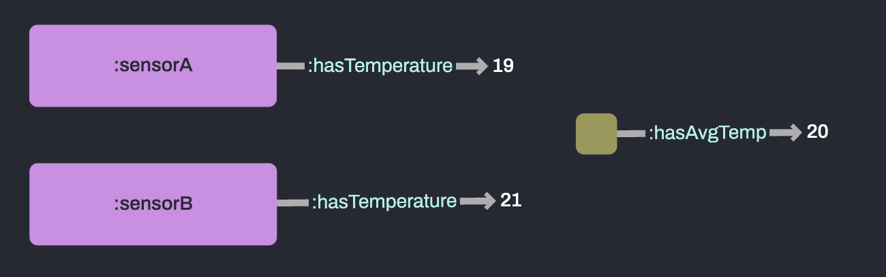

# 2.3 Blank Nodes

<br>

## 🔥 &nbsp; Why are Blank Nodes helpful?

Need to represent an abstract object where it's properties are important but it's identity isn't?

Blank Nodes are the answer!

For example, I have several sensors measuring the temperature of an industrial bath. The sensors are too detailed, I need to know about the bath as a whole.

<br>
<br>

## 📖 &nbsp; What are Blank Nodes?

Blank nodes enable us to represent entities that themselves have properties or relate to other nodes, without giving the node itself an IRI.

This is particularly relevant if the node itself is uninteresting or unknown but its relationships to the rest of the graph are, in which case a composite object that provides several details is more helpful.

Blank nodes are created without specifying an IRI - each time on startup, RDFox will generate a random identifier for this node in order to keep track of it.

<br>
<br>

## ⚡ &nbsp; Real world applications

Blank nodes are incredibly versatile, allowing abstract representations of data to be added directly to the graph.

As such, they can be used in almost any application, including:

<br>

### Finance

To generate objects that capture sprawling details such as in fraud chains, suspicious activity, or regulation breaches etc.

<br>

### IoT & On-device

To structure event data, surface high level system properties, catalog time-series events, etc.

<br>

### Data Management

To create useful structures from complex data, generate abstractions, etc.

<br>
<br>

## 📖 &nbsp; What is SKOLEM?

While blank nodes can be incredible useful, they can be difficult to work with due to this inconsistent anonymized identity which is why, in practice, we highly encourage using them with SKOLEM.

SKOLEM generates a blank node with a deterministic label from a series of input parameters of both variables and literals.

This means the new node retains a referenceable, reversible, meaningful IRI that can be based solely on selected properties.

<br>
<br>

## 🔬 &nbsp; Example - SKOLEMizing a node



The following rule creates a node from two sensor readings, representing the bath that they are measuring.

```
[?bathSummaryNode, :hasAvgTemp, ?avgTemp] :-
    [:sensorA, :hasTemperature, ?temp1],
    [:sensorB, :hasTemperature, ?temp2],
    BIND((?temp1 + ?temp2)/2 AS ?avgTemp),
    SKOLEM("Bath Summary", ?avgTemp, ?bathSummaryNode) .
```

Here is the data we'll be using to show this:

```
:sensorA :hasTemperature 19 .

:sensorB :hasTemperature 21 .
```

<br>
<br>

## ℹ️ &nbsp; Syntax helper

`SKOLEM("input1", ?input2, ..., ?output)`

The last argument given to SKOLEM is the variable that will be bound to the generated value.

All preceding arguments contribute to its generation.

Arguments can be either a variable or literal.

<br>
<br>

## ✅ &nbsp; Check the results

Run `2_3-BlankNodes/example/exScript.rdfox` to see the results of this rule.

<br>

### You should see...

================= Average Bath Temperature =================
|?bathSummaryNode|	?avgTemp|
|----------------------------------------------|----|
|_:_.05QmF0aCBTdW1tYXJ5AA.16FAAAAAAAAAAAAAAAAAAAAA|	20.0|

<br>

### Visualise the results

Open this query in the [RDFox Explorer](http://localhost:12110/console/datastores/explore?datastore=default&query=SELECT%20%3FbathReadingEncoded%20%3FtemperatureEstimate%20%0AWHERE%20%7B%0A%20%20%20%20%3FbathReadingEncoded%20%3AhasAvgTemp%20%3FtemperatureEstimate%20.%0A%7D%0A).

<br>
<br>

## 🔬 &nbsp; Example - reversing SKOLEM

SKOLEM is a reversible process. Given a SKOLEMized node IRI, we can determine the resources that were used to create it.

Here is a rule that unpicks the SKOLEM node we just created:

```
[?originalSting, :derivedFrom, ?bathSummaryNode],
[?originalTempReading, :derivedFrom, ?bathSummaryNode] :-
    [?bathSummaryNode, :hasAvgTemp, ?avgTemp],
    SKOLEM(?originalSting, ?originalTempReading, ?bathSummaryNode) .
```

<br>
<br>

## ℹ️ &nbsp; Syntax helper

`SKOLEM(?output1, ?output2, ..., ?input)`

The same SKOLEM function can be used to reverse the process as was used to produce it in the first place.

This time, a SKOLEMized node can be given as the final parameter and the proceeding variables will be assigned a value by reversing the process.

<br>
<br>

## ✅ &nbsp; Check the results

Ensuring you have already run the first script...

now run `2_3-BlankNodes/example2/exScript.rdfox` to see the results of this rule.

<br>

### You should see...

========================= SKOLEM reversed =========================
|?SKOLEMNode|	?originalComponent|
|----------------------------------------------|----|
|_:_.05QmF0aCBTdW1tYXJ5AA.16FAAAAAAAAAAAAAAAAAAAAA|	20.0|
|_:_.05QmF0aCBTdW1tYXJ5AA.16FAAAAAAAAAAAAAAAAAAAAA|	"Bath Summary"|

<br>

### Visualise the results

Open this query in the [RDFox Explorer](http://localhost:12110/console/datastores/explore?datastore=default&query=SELECT%20%3FSKOLEMNode%20%3ForiginalComponent%0AWHERE%20%7B%0A%20%20%20%20%3FSKOLEMNode%20%3AderivedFrom%20%3ForiginalComponent%20.%0A%7D).

<br>
<br>

## 🚀 &nbsp; Exercise

Complete the rule `2_3-BlankNodes/incompleteRules.dlog` to monitor the average temperature of several liquid baths as they change over time - creating a unique node to represent the bath at each given moment in time.

Here is a representative sample of the data in `2_3-BlankNodes/exercise/data.ttl`. Both baths contain **exactly two sensors**.
```
:readingA001 a :SensorReading ;
    :fromSensor :sensorA ;
    :hasTemperature 18 ;
    :hasTimeStamp "2024-12-25T12:00:00"^^xsd:dateTime .

:readingB001 a :SensorReading ;
    :fromSensor :sensorB ;
    :hasTemperature 20 ;
    :hasTimeStamp "2024-12-25T12:00:00"^^xsd:dateTime .

:bathAlpha a :Bath .

:sensorA a :Sensor ;
    :locatedIn :bathAlpha .

```

<br>
<br>

## 📌 &nbsp; Hints & helpful resources

[SKOLEM in RDFox](https://docs.oxfordsemantic.tech/tuple-tables.html#skolem)

<br>
<br>

## ✅ &nbsp; Check your answers

Run the script below to verify the results.

`2_3-BlankNodes/exercise/script.rdfox`

<br>

### You should see...

=== Bath temperature over time ===
|?bath|?time|?temperatureEstimate|
|-----------|-------------|-------------|
|:bathAlpha|	"2025-12-25T00:00:00"^^xsd:dateTime|	16.0|
|:bathAlpha|	"2025-12-25T02:00:00"^^xsd:dateTime|	16.5|
|:bathAlpha|	"2025-12-25T04:00:00"^^xsd:dateTime|	17.5|
|:bathAlpha|	"2025-12-25T06:00:00"^^xsd:dateTime|	19.0|
|:bathAlpha|	"2025-12-25T08:00:00"^^xsd:dateTime|	20.0|
|:bathAlpha|	"2025-12-25T10:00:00"^^xsd:dateTime|	22.0|
|:bathAlpha|	"2025-12-25T12:00:00"^^xsd:dateTime|	23.5|
|:bathAlpha|	"2025-12-25T14:00:00"^^xsd:dateTime|	23.5|
|:bathAlpha|	"2025-12-25T16:00:00"^^xsd:dateTime|	24.0|
|:bathAlpha|	"2025-12-25T18:00:00"^^xsd:dateTime|	23.5|
|:bathAlpha|	"2025-12-25T20:00:00"^^xsd:dateTime|	24.5|
|:bathAlpha|	"2025-12-25T22:00:00"^^xsd:dateTime|	24.0|
|:bathBeta|	"2025-12-25T00:00:00"^^xsd:dateTime|	16.0|
|:bathBeta|	"2025-12-25T02:00:00"^^xsd:dateTime|	16.0|
|:bathBeta|	"2025-12-25T04:00:00"^^xsd:dateTime|	16.5|
|:bathBeta|	"2025-12-25T06:00:00"^^xsd:dateTime|	16.5|
|:bathBeta|	"2025-12-25T08:00:00"^^xsd:dateTime|	17.5|
|:bathBeta|	"2025-12-25T10:00:00"^^xsd:dateTime|	19.5|
|:bathBeta|	"2025-12-25T12:00:00"^^xsd:dateTime|	20.5|
|:bathBeta|	"2025-12-25T14:00:00"^^xsd:dateTime|	21.5|
|:bathBeta|	"2025-12-25T16:00:00"^^xsd:dateTime|	22.5|
|:bathBeta|	"2025-12-25T18:00:00"^^xsd:dateTime|	23.5|
|:bathBeta| "2025-12-25T20:00:00"^^xsd:dateTime |24.5 .|
|:bathBeta |"2025-12-25T22:00:00"^^xsd:dateTime |25.5 .|
|:bathGamma |"2025-12-25T00:00:00"^^xsd:dateTime |15.5 .|
|:bathGamma |"2025-12-25T02:00:00"^^xsd:dateTime |16.5 .|
|:bathGamma |"2025-12-25T04:00:00"^^xsd:dateTime |17.5 .|
|:bathGamma |"2025-12-25T06:00:00"^^xsd:dateTime |19.5 .|
|:bathGamma |"2025-12-25T08:00:00"^^xsd:dateTime |19.5 .|
|:bathGamma |"2025-12-25T10:00:00"^^xsd:dateTime |20.0 .|
|:bathGamma |"2025-12-25T12:00:00"^^xsd:dateTime |21.0 .|
|:bathGamma |"2025-12-25T14:00:00"^^xsd:dateTime |23.0 .|
|:bathGamma |"2025-12-25T16:00:00"^^xsd:dateTime |23.5 .|
|:bathGamma|	"2025-12-25T18:00:00"^^xsd:dateTime|	24.5|
|:bathGamma|	"2025-12-25T20:00:00"^^xsd:dateTime|	26.5|
|:bathGamma|	"2025-12-25T22:00:00"^^xsd:dateTime|	26.0|


<br>
<br>

## 👏 &nbsp; Bonus exercise - MD5 Encoding

As a practical alternative to SKOLEM, the MD5 hash generator function sometimes is instead to create an ID for a node.

MD5 creates IDs more efficiently than SKOLEM but is non-reversible, meaning retraction of facts is vastly less efficient.

Additionally, it is not strictly 1-1, so it is possible, albeit unlikely, to have two different inputs create the same output, 

MD5 is a function not a tuple table, so the output must be bound to a new variable, and it's input must be strings.

<br>

Write a rule that creates a similar node for each bath using the `MD5` function instead of `SKOLEM`.

`BIND ( MD5("stringIn") AS ?stringOut )`

Write a query [in the console](http://localhost:12110/console/datastores/sparql?datastore=default) to validate you work.

Discuss your solutions with others in the `RDFox-Workshop` channel of our [Slack Community](https://join.slack.com/t/rdfox/shared_invite/zt-1z7dnm2ad-WoKRf~~3CynB_KTi5X0RHg)!
