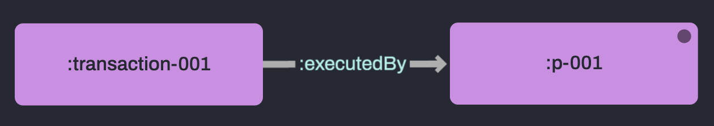
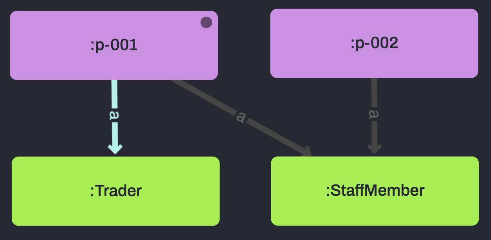

# 2.4 Named Graphs

<br>

## 🔥 &nbsp; Why are Named Graphs helpful?

Need to partition or control access to data but want to silo all your data in one place or allow some sharing of information between the groups?

Named Graphs are the solution!

For example, I have private employee information and data about their day-to-day work. I need to keep them separate and restrict access but cross reference them easily.

<br>
<br>

## 📖 &nbsp; What are Named Graphs?

Named Graphs offer a way to partition your data and are commonly used to group semantically similar data.

Data in named graphs are stored as quads, with the fourth entry representing the named graph.

As such, we don't need to 'create' named graphs, they exist by being referenced in a quad.

<br>
<br>

## ⚡ &nbsp; Real world applications

Named Graphs can be used in almost every use case as a way to partition data.

This is particularly relevant to:

<br>

### Access Control & Privacy
To restrict access to specific parts of the data, to separate data definitively, ensure no contamination of data, etc.

<br>

### Finance
To separate user's personal information from their transactional data, to store information about products alongside users, etc.

<br>

### IoT
To chunk data packets by timestamp, to group devices by location, to group devices by device class, etc.

<br>
<br>

## 📖 &nbsp; What is the Default Graph?

The default graph is unlike named graphs in that it has no name and stores triples rather than quads.

Without specifying a named graph RDFox will reference the default graph.

<br>
<br>

## 🔬 &nbsp; Example





The following rule shows how how to access data in the Default Graph and a Named Graph, pulling personal information from the `:personnelInfo` graph and transaction data from the `default` graph.

This allows us to classify any of our staff members who have executed a transaction as a `:Trader`.

```
[?personnel, a, :Trader] :PersonnelInfo :-
    [?personnel, a, :StaffMember] :PersonnelInfo,
    [?trade, :executedBy, ?personnel] .
```

Here is the data we'll use to show this:
```
# Personnel Info Named Graph
:PersonnelInfo {
    :p-001 a :StaffMember .
    :p-002 a :StaffMember .
}

# Default Graph
:transaction-001 :executedBy :p-001 .
```

<br>
<br>

## ✅ &nbsp; Check the results

Run `2_4-NamedGraphs/example/exScript.rdfox` to see the results of this rule.

<br>

========= Personnel Rolls =========
|?personnel	|?roll|
|----|----|
|:p-001 |:Trader |
|:p-002 |:StaffMember |

<br>

### Visualise the results

Open this query in the [RDFox Explorer](http://localhost:12110/console/datastores/explore?datastore=default&query=SELECT%20%3Fpersonnel%20%3Froll%0AWHERE%20%7B%0A%20%20%20%20GRAPH%20%3APersonnelInfo%20%7B%3Fpersonnel%20a%20%3AStaffMember%7D%20.%0A%20%20%20%20OPTIONAL%20%7B%20SELECT%20%3Fpersonnel%20%3FactiveTrader%0A%20%20%20%20%20%20%20%20WHERE%20%7B%0A%20%20%20%20%20%20%20%20%20%20%20%20VALUES%20%3FactiveTrader%20%7B%3ATrader%7D%0A%20%20%20%20%20%20%20%20%20%20%20%20GRAPH%20%3APersonnelInfo%20%7B%3Fpersonnel%20a%20%3FactiveTrader%7D%20.%0A%20%20%20%20%20%20%20%20%7D%0A%20%20%20%20%7D%0A%20%20%20%20BIND%28COALESCE%28%3FactiveTrader%2C%20%3AStaffMember%29%20AS%20%3Froll%29%0A%7D%0A).

<br>
<br>

## ℹ️ &nbsp; Syntax helper

Named graphs can be accessed by including its name (or stating a variable) after the desired triple pattern within the graph.

When writing rules, `[?S, ?O, ?O] :myNamedGraph` is used to access a specific graph and `[?S, ?O, ?O] ?G` will access all named graphs.

A slightly different syntax is used when writing queries, declaring the Named Graph before the triple pattern with the `GRAPH` keyword.

`GRAPH :myNamedGraph {?S ?P ?O}` or `GRAPH ?G {?S ?P ?O}`.

Rules and queries can reference several named graphs in both the head and body simultaneously.

<br>
<br>

## 🚀 &nbsp; Exercise

Complete the rule `2_4-NamedGraphs/incompleteRules.dlog` in order to directly find traders who have breached their personal trade-value limits.

Here is a representative sample of the data in `2_4-NamedGraphs/exercise/data.ttl`.
```
:PersonnelInfo {
    :p-001 a :Trader ;
        :hasMaxTradeRestriction 100000 .
    
    :p-002 a :StaffMember .
}

:t-000001 a :Transaction ;
    :executedBy :p-001 ;
    :hasValue 50000 .
```

<br>
<br>

## 📌 &nbsp; Hints & helpful resources

[Named Graphs syntax in RDFox](https://docs.oxfordsemantic.tech/reasoning.html#named-graphs-and-n-ary-relations)

<br>
<br>

## ✅ &nbsp; Check your answers

Run `2_4-NamedGraphs/exercise/script.rdfox` to see the results of this rule.

<br>

### You should see...

=== Traders in Trouble ===
|?personnel|?limit|?trade|?tradeValue|
|-----------|-------------|-------------|-------------|
|:p-075|	80000|	:t-075011|	115606|
|:p-041|	130000|	:t-041021|	185874|
|:p-043|	150000|	:t-043025|	222928|

<br>

### Visualise the results

Open this query in the [RDFox Explorer](http://localhost:12110/console/datastores/explore?datastore=default&query=SELECT%20%3Fpersonnel%20%3Flimit%20%3Ftrade%20%3FtradeValue%0AWHERE%20%7B%0A%20%20%20%20GRAPH%20%3APersonnelInfo%20%7B%0A%20%20%20%20%20%20%20%20%3Fpersonnel%20%3AinBreachOfRegulation%20true%20%3B%0A%20%20%20%20%20%20%20%20%20%20%20%20%3AhasMaxTradeRestriction%20%3Flimit.%0A%20%20%20%20%7D%20.%0A%0A%20%20%20%20%3Ftrade%20%3AexecutedBy%20%3Fpersonnel%20%3B%0A%20%20%20%20%20%20%20%20%3AhasValue%20%3FtradeValue%20%3B%0A%20%20%20%20%20%20%20%20a%20%3ABreachOfRegulation%20.%0A%7D).

<br>
<br>

## 👏 &nbsp; Bonus exercise

Write a rule that creates a new named graph, `:traderStats` which stores the traders and their total lifetime trading value.

Write a query [in the console](http://localhost:12110/console/datastores/sparql?datastore=default) to validate you work.

<br>
<br>

## 🔍 &nbsp; Bonus info: Tuples Tables

RDFox actually stores data as lists of facts in containers called tuple tables.

Two in-memory tuple tables are created automatically upon creating a new data store, the `DefaultTriples` table that stores triples in the default graph and the `Quads` table that contains all named graphs quads.

Tuple tables [must be created](https://docs.oxfordsemantic.tech/tuple-tables.html#managing-and-using-tuple-tables) in order to be used.

Alongside other features, such as a name, a defining property of tuple tables are is their 'arity' - the number of columns they contain.

There are actually 3 types of tuple tables:
1. In-memory tuple tables (like DefaultTriples and Quads.)

&nbsp;&nbsp;&nbsp;&nbsp;&nbsp;&nbsp;&nbsp;&nbsp;&nbsp;&nbsp;&nbsp;&nbsp;These are used to store RDF data. Additional in-memory tuple tables can be created of arity 1-4, or deleted to save memory if required (including those created automatically).

2. Built-in tuple tables

&nbsp;&nbsp;&nbsp;&nbsp;&nbsp;&nbsp;&nbsp;&nbsp;&nbsp;&nbsp;&nbsp;&nbsp;These cannot be modified and contain useful information or functional benefits. They include **SKOLEM**, **SHACL**, and **rule dependencies**, each of which we will cover in these exercises (if you've completed 2.3 you will have used the SKOLEM table already).

3. Data source tuple tables

&nbsp;&nbsp;&nbsp;&nbsp;&nbsp;&nbsp;&nbsp;&nbsp;&nbsp;&nbsp;&nbsp;&nbsp;These are virtual tables in that they do not themselves exist in-memory - they create a view that references non-RDF data sources (such as CSV, SQL, Solr, etc.) that have been registered by the user. This is covered in more detail in the date management section.

<br>
<br>

## ℹ️ &nbsp; Syntax helper

Accessing custom tuple tables is slightly different again, with rule atoms taking the form:

`TupleTableName(?S, ?P, ?O, ?Q, ...)`

and queries accessing them via the `TT` keyword:

`TT TupleTableName { ?S ?P ?O ?Q ...}`
