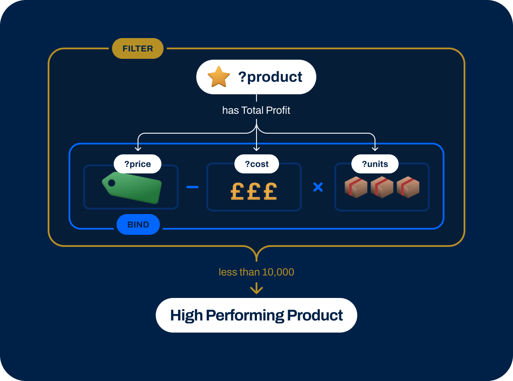
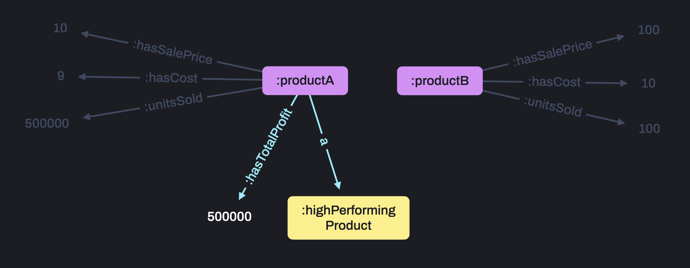

# 3.1 Rules as Views


<br>

## 🔥 &nbsp; Why are Views helpful?

Ever wanted to use part of a query again and again or optimise a taxing calculation?

Views are the answer!

For example I'm creating a product dashboard to highlight important sales figures. 

<br>
<br>

## 📖 &nbsp; What are Views?



<br>
<br>

Views transform existing data into simpler or more accessible information, often turning important complex patterns into a single relationship or applying filters to narrow down the result set based on a condition.

Views simplify SPARQL, reduce repetition in code, and accelerate query performance - they are incredible useful.

<br>
<br>

## ⚡ &nbsp; Real world applications

Views are universally applicable as a fundamental application of rules.

<br>

### Retail

To create a sales dashboard with critical stats and figures, to calculate important product-based metrics, to highlight high performing products etc.

<br>

### IoT

To track key system properties and device metrics, to plan and predict maintenance, to simplify complex analysis into a single value, etc.

<br>

### Finance

To surface critical information about clients and transactions, to flag security or regulation breaches, etc.

<br>
<br>

## 🔬 &nbsp; Example


<br>
<br>
The following rule provides information for a view of the profit from our best selling products - that is, the products that have sold over 10,000 units.

```
[?product, a, :highPerformingProduct],
[?product, :hasTotalProfit, ?totalProfit] :-
    [?product, :unitsSold, ?units],
    [?product, :hasCost, ?cost],
    [?product, :hasSalePrice, ?price],
    BIND ( (?price - ?cost) * ?units AS ?totalProfit ),
    FILTER (?units > 10000).
```

Here is the data we'll be using to show this:

```
:productA :unitsSold 500000 ;
    :hasCost 9 ;
    :hasSalePrice 10 .

:productB :unitsSold 100 ;
    :hasCost 10 ;
    :hasSalePrice 100 .
```

<br>
<br>

## ✅ &nbsp; Check the results

Run `3_1-RulesAsViews/example/exScript.rdfox` to see the results of this rule.

<br>

### You should see...

=== High Performing Products ===
|?product|	?units| ?totalProfit|
|---|---|---|
|<https://rdfox.com/example#productA>|	500000|	500000|

<br>

### Visualise the results

Open this query in the [RDFox Explorer](http://localhost:12110/console/datastores/explore?datastore=default&query=SELECT%20%3Fproduct%20%3FtotalProfit%20%3Funits%0AWHERE%20%7B%0A%20%20%20%20%3Fproduct%20a%20%3AhighPerformingProduct%20%3B%0A%20%20%20%20%20%20%20%20%3AunitsSold%20%3Funits%20%3B%0A%20%20%20%20%20%20%20%20%3AhasTotalProfit%20%3FtotalProfit%20.%0A%7D%20ORDER%20BY%20DESC%28%3FtotalProfit%29).

<br>
<br>

## 🔍 &nbsp; Incremental Reasoning

As new data is added or old is removed, reasoning updates incrementally meaning the view is always kept consistent with changes in real-time.

This is a very efficient process which considers the smallest necessary part of the graph to compute the change.

To show this, we'll add a new product to our database:

```
:productX :unitsSold 100000 ;
    :hasCost 10 ;
    :hasSalePrice 110 .
```
<br>

## ✅ &nbsp; Check the results

Ensuring that you have run the first script...

now run `3_1-RulesAsViews/example2/exScript.rdfox` to add this new product data and re-run the query.

<br>

### You should see...

=== High Performing Products ===
|?product|	?units| ?totalProfit|
|---|---|---|
|<https://rdfox.com/example#productX>|	100000|	10000000|
|<https://rdfox.com/example#productA>|	500000|	500000|

<br>
<br>

## 🔍 &nbsp; Explainable results

RDFox keeps track of the inferences it makes, storing the chain of rules that support each facts existence.

This means all inferred results can be explained in proof trees of the facts and rules that lead to them.

<br>

### Exploring explanations

Head to the **Explain** tab of the RDFox console to start visualising an explanation, or right click on an edge in the **Explore** tab and selecting **Explain**.

[Here is a link](http://localhost:12110/console/datastores/explain?datastore=default&fact=%5B%3Chttps%3A%2F%2Frdfox.com%2Fexample%23productA%3E%2C%20%3Chttp%3A%2F%2Fwww.w3.org%2F1999%2F02%2F22-rdf-syntax-ns%23type%3E%2C%20%3Chttps%3A%2F%2Frdfox.com%2Fexample%23highPerformingProduct%3E%5D) to the explanation of `productA a :highPerformingProduct`.

<br>
<br>

## 🔍 &nbsp; RAG (Retrieval Augmented Generation) and LLMs

Views have become increasingly relevant as the world has adopted LLMs for commercial use.

LLMs hallucinate, making them a poor enterprise technology alone, but this can be combated by combining them with a database using a method called RAG.

However, while using a standard database reduces hallucinations, it also drastically restricts the questions that the LLM can answer.

Fortunately, rules and reasoning can be used to supercharge this setup, enabling the LLM to answer vastly more complex questions such as those involving counts, filters, negation, and all the other functionality in this workshop.

<br>
<br>

## 🚀 &nbsp; Exercise

Complete the rule `3_1-RulesAsViews/incompleteRules.dlog` to create a view of product categories and the **average** units sold over all products in that category.

Here is a representative sample of the data in `3_1-RulesAsViews/exercise/data.ttl`.

```
:product0001 a :Product,
                :Chair ;
    :unitsSold 3000 ;
    :hasCost 40 ;
    :hasSalePrice 50 .

:product0002 a :Product,
                :Sofa ;
    :unitsSold 100 ;
    :hasCost 120 ;
    :hasSalePrice 300 .
```

<br>
<br>

## 📌 &nbsp; Hints & helpful resources

[Averages](https://docs.oxfordsemantic.tech/querying.html#aggregate-functions) are a form of aggregates.

<br>
<br>

## ✅ &nbsp; Check your answers

Run `3_1-RulesAsViews/exercise/script.rdfox` to see the results of this rule.

<br>

### You should see...

=== Product Category Average Profit ===
|?productCategory|?averageCategoryUnitsSold|
|-----------|-------------|
|<https://rdfox.com/example/Chair>|	10263.0|
|<https://rdfox.com/example/Product>|	5065.0|
|<https://rdfox.com/example/Sofa>|	4922.0|
|<https://rdfox.com/example/Stool>|	2491.0|
|<https://rdfox.com/example/Beanbag>|	2423.0|

<br>

### Visualise the results

Open this query in the [RDFox Explorer](http://localhost:12110/console/datastores/explore?datastore=default&query=SELECT%20%3FproductCategory%20%3FaverageCategoryUnitsSold%0AWHERE%20%7B%0A%20%20%20%20%3FproductCategory%20%3AhasAverageUnitsSold%20%3FaverageCategoryUnitsSold%20.%0A%7D%20ORDER%20BY%20DESC%20%28%3FaverageCategoryUnitsSold%29).

<br>
<br>

## 👏 &nbsp; Bonus exercise

Write a rule that creates a view to identify pre-sale products (missing :unitsSold data) and adds them to a 'PreSale' named graph.

Write a query [in the console](http://localhost:12110/console/datastores/sparql?datastore=default) to validate you work.

Discuss your solutions with others in the `RDFox-Workshop` channel of our [Slack Community](https://join.slack.com/t/rdfox/shared_invite/zt-1z7dnm2ad-WoKRf~~3CynB_KTi5X0RHg)!
