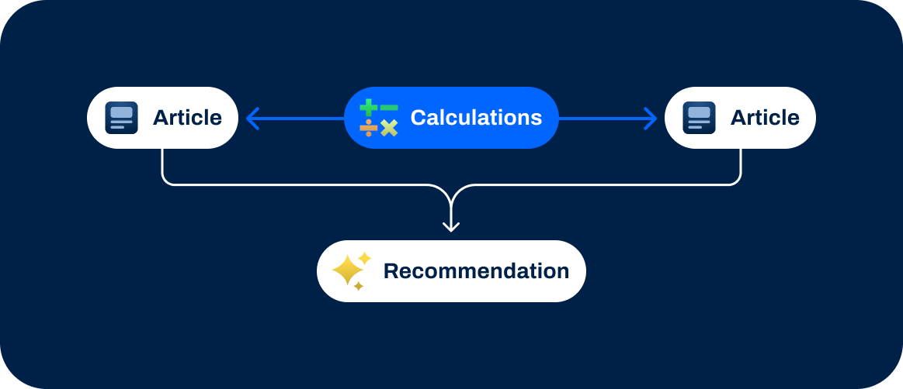
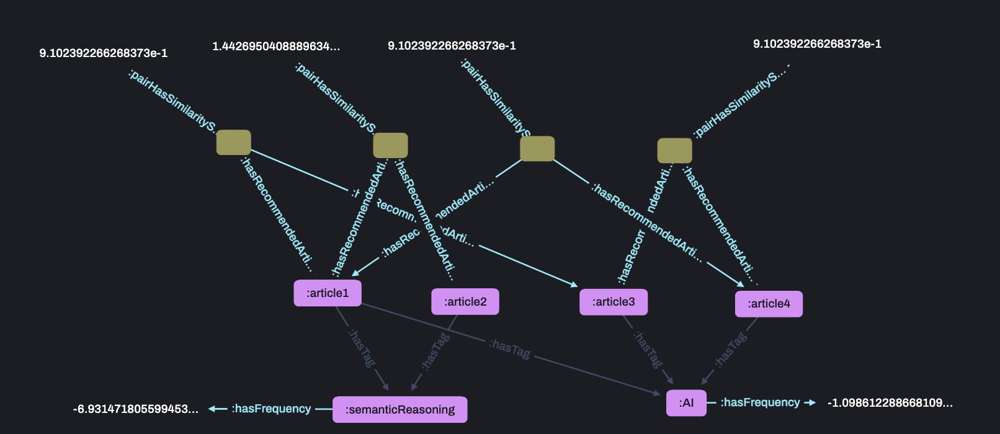

# 3.2 Complex Calculations


<br>

## 🔥 &nbsp; Why are Complex Calculations helpful?

Need to perform calculations or any complexity in your application?

RDFox has you covered!

For example, my application requires complex mathematical algorithms to compute specific metrics, such as recommendations.

<br>
<br>

## 📖 &nbsp; What are Complex Calculations?



<br>
<br>

BINDS calculate an expression and store result in a variable.

This can be done with inbuilt RDFox functions or hand written mathematical expressions.

In practice it's very common to construct complex results using several rules - breaking the problem down into bite sized chunks.

This can also greatly benefit the efficiency of reasoning - some common examples are explored throughout the workshop.

<br>
<br>

## ⚡ &nbsp; Real world applications

Calculations are relevant in almost every use case, whenever data needs to be transformed or analysed.

<br>

### Finance

To recognize fraud in real-time based on complex triggers, to apply regulation restrictions to transactions, etc.

<br>

### Data Analysis

To compute complex mathematical functions over large and changing data, to surface valuable insights, etc.

<br>

### Manufacturing

To calculate complex product compatibility, to model configuration viability, to simulate failure modes and maintenance, etc.

<br>
<br>

## 🔬 &nbsp; Example


<br>
<br>
The following rules perform Term Frequency Analysis for articles tagged by their content types, in order to recommend similar articles.

```
[?tag, :hasFrequency, ?termFrequency] :-
    AGGREGATE (
        [?article, :hasTag, ?tag]
        ON ?tag
        BIND COUNT(?article) AS ?totalTagMentions
    ),
    BIND (LOG(1/?totalTagMentions) AS ?termFrequency) .
```
```
[?recommendationNode, :hasRecommendedArticle, ?article1],
[?recommendationNode, :hasRecommendedArticle, ?article2],
[?recommendationNode, :pairHasSimilarityScore, ?similarityScore] :-
    AGGREGATE(
        [?article1, :hasTag, ?tag],
        [?article2, :hasTag, ?tag],
        [?tag, :hasFrequency, ?termFrequency]
        ON ?article1 ?article2
        BIND SUM( -1 / ?termFrequency ) AS ?similarityScore
    ),
    SKOLEM(?article1, ?article2, ?recommendationNode),
    FILTER(?article1 > ?article2) .
```

Here is the data we'll be using to show this:

```
:article1 :hasTag :AI ,
                :semanticReasoning .

:article2 :hasTag :semanticReasoning .

:article3 :hasTag :AI .

:article4 :hasTag :AI .
```

<br>
<br>

## ✅ &nbsp; Check the results

Run `3_2-ComplexCalculations/example/exScript.rdfox` to see the results of this rule.

<br>

### You should see...

=== Similar Articles ===
|?article1	|?article2|	?similarityScore|
|---|---|---|
|:article1|	:article2|	1.4426950408889634e+0|
|:article1|	:article4|	9.1023922662683732e-1|
|:article1|	:article3|	9.1023922662683732e-1|
|:article3|	:article4|	9.1023922662683732e-1|

<br>

### Visualise the results

Open this query in the [RDFox Explorer](http://localhost:12110/console/datastores/explore?datastore=default&query=SELECT%20%3FrecommendationNode%20%3Farticle1%20%3Farticle2%20%3FsimilarityScore%20%3Ftag%0AWHERE%20%7B%0A%20%20%20%20%3FrecommendationNode%20%3AhasRecommendedArticle%20%3Farticle1%20%3B%0A%20%20%20%20%20%20%20%20%3AhasRecommendedArticle%20%3Farticle2%20%3B%0A%20%20%20%20%20%20%20%20%3ApairHasSimilarityScore%20%3FsimilarityScore%20.%0A%20%20%20%20%3Farticle1%20%3AhasTag%20%3Ftag%0A%20%20%20%20FILTER%28%3Farticle1%20%3C%20%3Farticle2%29%0A%7D%20ORDER%20BY%20ASC%28%3Farticle1%29%20DESC%28%3FsimilarityScore%29).

<br>
<br>

## ℹ️ &nbsp; Syntax helper

These Term Frequency Analysis rules assign common terms a lower weighting than rarer terms.

A node is created between two articles that share at least one tag, calculating a similarity score based on shared weighted tags.

<br>
<br>

## 🚀 &nbsp; Exercise

Complete the rule `3_2-ComplexCalculations/incompleteRules.dlog` to calculate the percentage of articles that each tag appears in, rounded to the nearest percentage point:

Here is a representative sample of the data in `3_2-ComplexCalculations/exercise/data.ttl`.

```
:blog :containsArticle :article001 ,
                        :article002 .

:article001 a :Article ;
    :hasTag :AI ,
        :SemanticReasoning ,
        :Technology .
```

<br>
<br>

## 📌 &nbsp; Hints & helpful resources

[Mathematical functions in RDFox](https://docs.oxfordsemantic.tech/querying.html#mathematical-functions)

<br>
<br>

## ✅ &nbsp; Check your answers

Run `3_2-ComplexCalculations/exercise/script.rdfox` to see the results of this rule.

<br>

### You should see...

=== Percentage of articles mentioning tags ===
|?percentage|?tag|
|-----------|-------------|
|75.0|	:SemanticReasoning|
|63.0|	:Technology|
|56.0|	:KnowledgeRepresentation|
|44.0|	:RDFox|
|38.0|	:Datalog|
|30.0|	:LLMs|
|30.0|	:AI|

<br>
<br>

## 👏 &nbsp; Bonus exercise

Write some rules that use `EXP` to rank the exponential popularity of tags, normalising the distribution around the most popular tag.

Write a query [in the console](http://localhost:12110/console/datastores/sparql?datastore=default) to validate you work.

Discuss your solutions with others in the `RDFox-Workshop` channel of our [Slack Community](https://join.slack.com/t/rdfox/shared_invite/zt-1z7dnm2ad-WoKRf~~3CynB_KTi5X0RHg)!
