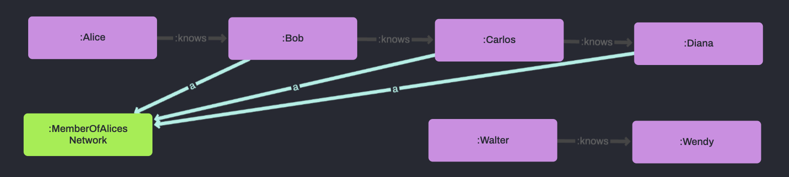

# 3.3 Property Paths

<br>

## 🔥 &nbsp; Why are Property Paths helpful?

Ever needed find a connection between two points of arbitrary length or with complex continuation conditions?

Recursive Property Paths are the answer!

For example, who are all of the people in my wider social network - the people who I don't just know directly, but who knows someone who knows someone who I know?

<br>
<br>

## 📖 &nbsp; What are Property Paths

Property paths in SPARQL represent chains of the same relationship.

They can be very helpful in practice as they enable queries for paths of arbitrary length but they are computationally taxing meaning performance is often slow.

Rules can do this vastly more efficiently and are able to encode more complex patterns that constrain the hops between chain links.

To do this, we need to apply a technique called Recursion.

<br>
<br>

## 📖 &nbsp; What is Recursion?

Recursive rules are self referential to some degree, meaning the facts the infer may create the conditions for additional facts to be inferred.

This iterative cycle will continue until the body conditions of the rules involved are no longer met.

In the case of property paths, recursive rules take one step along the chain with each iteration, creating the conditions for the next step as they go.

<br>
<br>

## ⚡ &nbsp; Real world applications

Recursion and Property Paths are widely used as the flexibility of their arbitrary nature makes they perfect to encapsulate the messiness of real world data.

<br>

### Social Networks

To find indirectly connected members of an extended social network, to identify chains of people of a particular seniority of company, etc.

<br>

### Construction

To identify flaws or weaknesses in designs, to create a bill of materials, to isolate material components, etc.

<br>

### Retail

To monitor and stress-test supply chains, to analyse customer buying patterns and improve recommendations, etc.

<br>
<br>

## 🔬 &nbsp; Example



The following rules recursively detect members of Alice's network - including people she both directly and indirectly knows.

```
[?person, a, :MemberOfAlicesNetwork] :-
    [:Alice, :knows, ?person].

[?person2, a, :MemberOfAlicesNetwork] :-
    [?person1, a, :MemberOfAlicesNetwork] ,
    [?person1, :knows, ?person2] .
```

Here is the data we'll be using to show this:

```
:Alice :knows :Bob .

:Bob :knows :Carlos .

:Carlos :knows :Diana .

:Walter :knows :Wendy .
```

<br>
<br>

## ✅ &nbsp; Check the results

Run `3_3-PropertyPaths/example/exScript.rdfox` to see the results of this rule.

<br>

### You should see...

=== Members of Alices wider Network ===
|?person|	?networkMember|
|---|---|
|:Diana|	:MemberOfAlicesNetwork|
|:Carlos|	:MemberOfAlicesNetwork|
|:Bob|	:MemberOfAlicesNetwork|

<br>

### Visualise the results

Open this query in the [RDFox Explorer](http://localhost:12110/console/datastores/explore?datastore=default&query=SELECT%20%3Fperson%20%3FnetworkMember%0AWHERE%20%7B%0A%20%20%20%20%3Fperson%20a%20%3FnetworkMember%20.%0A%7D).

<br>
<br>

## 🔍 &nbsp; End entities

It can be valuable to know the first or last member of a chain.

By utilising negation (see 2.2) this becomes trivial - we simply look for there not to exist a proceeding or succeeding member of the chain respectively.

The following rule identifies the web server as a top level asset.

```
[?person, a, :EndPoint] :-
    [?person, a, :MemberOfAlicesNetwork] ,
    NOT EXISTS ?person2 IN ( [?person, :knows, ?person2] ) .
```

<br>
<br>

## ✅ &nbsp; Check the results

Ensuring you have run the first script...

now run `3_3-PropertyPaths/example2/exScript.rdfox` to see the results of this rule.

<br>

### You should see...

=== End Points of Alices Network ===
|?person|
|---|
|:Diana|

<br>

### Visualise the results

Open this query in the [RDFox Explorer](http://localhost:12110/console/datastores/explore?datastore=default&query=SELECT%20%3Fperson1%20%3Fperson2%20%3Fp%20%3Fo%0AWHERE%20%7B%0A%20%20%20%20%3Fperson1%20%3Aknows%20%3Fperson2.%0A%20%20%20%20%0A%20%20%20%20%3Fperson2%20a%20%3AMemberOfAlicesNetwork%20%3B%0A%20%20%20%20%20%20%20%20%3Fp%20%3Fo%20.%0A%7D%0A).

<br>
<br>

## 🚀 &nbsp; Exercise

Complete the rule `3_3-PropertyPaths/incompleteRules.dlog` to find the number of hops away from Alice each member of her network is.

Here is a representative sample of the data in `3_3-PropertyPaths/exercise/data.ttl`.
```
:Alice a :Person ;
    :knows :Jacqueline,
        :Melissa,
        :Troy .
```

<br>
<br>

## 📌 &nbsp; Hints & helpful resources

Remember, as we are using cyclic logic (by the nature of recursive rules), we cannot use aggregates - we must make our recursive calculations with BIND.

Be careful when writing rules like this, as if the data is cyclic, RDFox will end up in an infinite loop, forever adding one more!

<br>
<br>

## ✅ &nbsp; Check your answers

Run `3_3-PropertyPaths/exercise/script.rdfox` to see the results of this rule.

<br>

### You should see...

=== How to Reach Alices Network Members ===
|?hopsAwayFromAlice|?person|
|-------------|-------------|
|1| :Melissa| 
|1| :Troy |
|1| :Jacqueline |
|2| :Sheri |
|2| :Donald |
|2| :Terri |
|2| :Mario|
|2| :Karen |
|2| :Mark |
|2| :Tony |
|2| :Jacob |
|2| :James|
|2| :Melanie |
|2| :Angela |
|2| :Desiree |
|3| :Robert |
|3| :Susan |
|3| :Bobby |
|3| :Timothy| 
|3| :Bryce |
...

<br>

### Visualise the results

Open this query in the [RDFox Explorer](http://localhost:12110/console/datastores/explore?datastore=default&query=SELECT%20%3FhopsAwayFromAlice%20%3Fperson%20%3Falice%0AWHERE%20%7B%0A%20%20%20%20%3Falice%20%3Aknows%20%3Fperson.%0A%20%20%20%20%0A%20%20%20%20%3Fperson%20a%20%3AMemberOfAlicesNetwork%20%3B%0A%20%20%20%20%20%20%20%20%3AhopsAwayFromAlice%20%3FhopsAwayFromAlice%20.%0A%7D%20ORDER%20BY%20ASC%28%3FhopsAwayFromAlice%29) and **change the layout to Breadth First**.


<br>
<br>

## 👏 &nbsp; Bonus exercise

Add to this rule set to find the route to each end point in Alice's network by using SKOLEM to create a node to represent the entire path - eg. who do we have to contact to get from Alice to Clifford and in what order?

Write a query [in the console](http://localhost:12110/console/datastores/sparql?datastore=default) to validate you work.

Discuss your solutions with others in the `RDFox-Workshop` channel of our [Slack Community](https://join.slack.com/t/rdfox/shared_invite/zt-1z7dnm2ad-WoKRf~~3CynB_KTi5X0RHg)!
