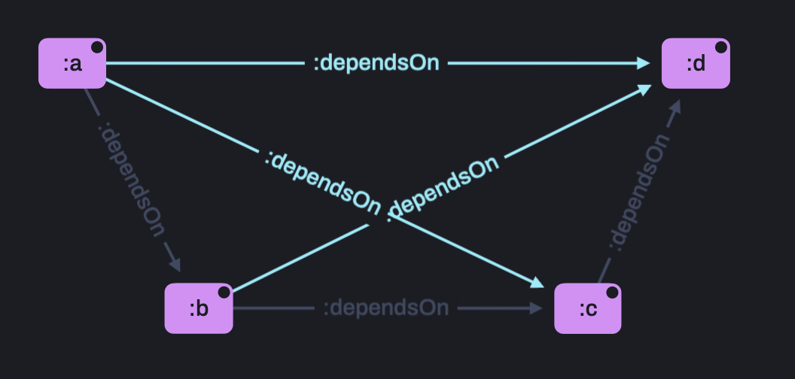
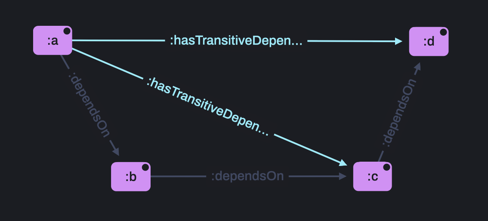

# 3.4 Transitive Closure


<br>

## 🔥 &nbsp; Why is Transitive Closure helpful?

Ever needed to find all nodes that are connected by an arbitrarily long repeating pattern, be that a chain of the same relationships or a more complex shape?

Transitive Closure is what you need!

For example, what are all of the dependencies of my IT assets, both direct and indirect?

<br>
<br>

## 📖 &nbsp; What is Transitive Closure?


<br>
<br>

Another common application of Recursion, Transitive closure forms direct links with all nodes that are indirectly connected via a chain of the same relationship.

Rules can encode single-edge relationships and complex patterns to compute the chain.

<br>
<br>

## ⚡ &nbsp; Real world applications

Recursion is a powerful and advanced tool with specific uses and yet is widely used as many applications would be impossible without it.

<br>

### Network Management

To find arbitrarily long routes between all possible pairs of locations, to determine viable paths where connections between individual nodes are restricted, etc.

<br>

### Finance

To detect chains of fraudulent behavior, to trace money as it is transferred between several accounts, etc.

<br>

### Manufacturing

To model dependencies and availability, to test failure modes and plan maintenance, etc.

<br>
<br>

## 🔬 &nbsp; Example


<br>
<br>
The following rules recursively traverse a network of IT assets to determine each of their direct and indirect dependencies.

```
[?asset1, :hasTransitiveDependency, ?asset2] :-
   [?asset1, :dependsOn, ?asset2] .

[?asset1, :hasTransitiveDependency, ?asset3] :-
   [?asset1, :hasTransitiveDependency, ?asset2],
   [?asset2, :dependsOn, ?asset3] .
```

Here is the data we'll be using to show this:

```
:webServer :dependsOn :machine .

:machine :dependsOn :network ,
                    :powerSupply .
```

<br>
<br>

## ✅ &nbsp; Check the results

Run `3_4-TransitiveClosure/example/exScript.rdfox` to see the results of these rules.

<br>

### You should see...

=== Assets whose function is dependent on others ===
|?upstreamAsset| ?transitiveRelationship|	?downstreamAsset|
|---|---|---|
|:webServer|	:hasTransitiveDependency|	:machine|
|:webServer|	:hasTransitiveDependency|	:network|
|:webServer|	:hasTransitiveDependency|	:powerSupply|
|:machine|	:hasTransitiveDependency|	:network|
|:machine|	:hasTransitiveDependency|	:powerSupply|

<br>

### Visualise the results

Open this query in the [RDFox Explorer](http://localhost:12110/console/datastores/explore?datastore=default&query=SELECT%20%3FupstreamAsset%20%3FP%20%3FdownstreamAsset%0AWHERE%20%7B%0A%20%20%20%20VALUES%20%3FP%20%7B%3AhasTransitiveDependency%7D%0A%20%20%20%20%3FupstreamAsset%20%3FP%20%3FdownstreamAsset%0A%7D%20ORDER%20BY%20DESC%28%3FupstreamAsset%29%20ASC%28%3FdownstreamAsset%29).

<br>
<br>

## 🔍 &nbsp; Efficient transitivity rules

You might be wondering why we introduce the new `:hasTransitiveDependency` relationship, why not just make `:dependsOn` a transitive property with a single rule?

Here are two rule sets that, from a practical perspective, achieve the same end result - closing the transitive dependencies in this system.

One uses an anchor:

```
   [?x, :hasTransitiveDependency, ?y] :-
      [?x, :dependsOn, ?y] .
   
   [?x, :hasTransitiveDependency, ?z] :-
      [?x, :hasTransitiveDependency, ?y] ,
      [?y, :dependsOn, ?z] .
```

The other uses the existing relationship

```
[?x, :dependsOn, ?z] :-
    [?x, :dependsOn, ?y],
    [?y, :dependsOn, ?z] .
```

This rule will end up considering many more facts than the previous one, making it significantly less efficient.

The inefficiency of this form of rule scales with data size, so we'll use this larger but simplified dataset to show the differences:

```
:a :dependsOn :b .
:b :dependsOn :c .
...
:x :dependsOn :y .
:y :dependsOn :z .
```

## 👀 &nbsp; Run the profiler

Run `3_4-TransitiveClosure/example2/exScript.rdfox` to see the performance of the **anchored** rule set...

### You should see...

Rule Info
|   #  |    Reasoning Phase   |   Sample Count  |  Rule Body Match Attempts |   Iterator Operations  |  Rule Body Matches  |    Fresh Facts Produced    |Rule of Head Atom|                               
|------|----------------------|-----------------|---------------------------|------------------------|---------------------|-------------------|------------------------------|
|   1|    Addition|      0|             325|             1.9k|           300|            300|          (0) :hasTransitiveDependency[?x, ?z] :- :hasTransitiveDependency[?x, ?y], :dependsOn[?y, ?z] .|
|   2|    RuleAdd|      0|             1|             26|           25|            25|          (0) :hasTransitiveDependency[?x, ?y] :- :dependsOn[?x, ?y] .|
|   3|    RuleAdd|      0|             1|             2|           0|            0|          (0) :hasTransitiveDependency[?x, ?z] :- :hasTransitiveDependency[?x, ?y], :dependsOn[?y, ?z] .|

Notice that the reasoniner undergoes 1.9k iterator operations to import 300 fresh facts.

The 25 fresh facts introduced by the ruleAdd phase are the simple proxy relationships `:hasTransitiveDependency` in place of the existing `:dependsOn` relationship.

## 👀 &nbsp; Run the profiler

Now run `3_4-TransitiveClosure/example3/exScript.rdfox` to see the performance of the **un-anchored** rule set...

### You should see...

Rule Info
|   #  |    Reasoning Phase   |   Sample Count  |  Rule Body Match Attempts |   Iterator Operations  |  Rule Body Matches  |    Fresh Facts Produced    |Rule of Head Atom|                               
|------|----------------------|-----------------|---------------------------|------------------------|---------------------|-------------------|------------------------------|
|   1|    Addition|      0|             600|             7.8k|           2.5k|            276|          (0) :dependsOn[?x, ?z] :- :dependsOn[?x, ?y], :dependsOn[?y, ?z] .|
|   2|    RuleAdd|      0|             1|             100|           24|            24|          (0) :dependsOn[?x, ?z] :- :dependsOn[?x, ?y], :dependsOn[?y, ?z] .|

During both phases, these rules import 276 + 24 fresh facts (totaling the same 300 as before), without creating the 25 proxy relationships.

Despite inferring 25 fewer total facts, notice that the iterator when though more than 4 times the operations at 7.8k!

### Why do these rule sets perform differently?

The un-anchored set derives the same facts in many different ways.


<br>
<br>
If we take a small sample as an example, by the time this recursive rule set is inferring `:a :dependsOn :d`, there are two supporting patters that must be considered:
1. `:a :dependsOn :b . :b :dependsOn :d .`
2. `:a :dependsOn :c . :c :dependsOn :d .`

This inefficiency scales with the size of the dataset and the complexity of the recursive conditions and quickly becomes impractical.

Compare this the the anchored reasoning where there us only one way to derive `:a :hasTransitiveDependency :d`:
1. `:a :hasTransitiveDependency :c . :c :dependsOn :d .`


<br>
<br>
<br>
<br>

## 🔍 &nbsp; Cyclic relationships

Recursion can create cyclic relationships, either intentionally or otherwise - in both cases it can be important to know when and where they exist.

Cyclic relationships that have been created through recursion are very simple to detect - we can simply look for an entity that belongs to its own chain.

In addition to original recursive rule set, the following rule identifies assets that belong to a cycle.

```
[?asset, a, :CyclicAsset] :-
    [?asset, :hasTransitiveDependency, ?asset].
```

To create a cycle, we must also add the following data to our existing dataset.

```
# Existing data

:webServer :dependsOn :machine .

:machine :dependsOn :network ,
                    :powerSupply .

# New data

:network :dependsOn :webServer .
```

<br>
<br>

## ✅ &nbsp; Check the results

Now run `3_4-TransitiveClosure/example4/exScript.rdfox` to see the results of this rule.

<br>

### You should see...

=== Cycles ===
|?cyclicAsset|	?downstreamAsset|
|---|---|
|:machine|	:network|
|:network|	:webServer|
|:webServer|	:machine|

<br>

### Visualise the results

Open this query in the [RDFox Explorer](http://localhost:12110/console/datastores/explore?datastore=default&query=SELECT%20%3FcyclicAsset%20%3FdownstreamAsset%0AWHERE%20%7B%0A%20%20%20%20%3FcyclicAsset%20a%20%3ACyclicAsset%20%3B%0A%20%20%20%20%20%20%20%20%3AdependsOn%20%3FdownstreamAsset%20.%0A%20%20%20%20%0A%20%20%20%20%3FdownstreamAsset%20a%20%3ACyclicAsset%20.%0A%7D%20ORDER%20BY%20ASC%28%3FcyclicAsset%29).


<br>
<br>

## 🚀 &nbsp; Exercise

Complete the rule `3_4-TransitiveClosure/exercise/incompleteRules.dlog` to calculate the transitive dependencies between just primary assets - that is, assets that have a `:backupPriority "Primary"`.

Here is a representative sample of the data in `3_4-TransitiveClosure/exercise/data.ttl`.

```
:webServer1 a :WebServer ;
    :backupPriority "Primary" ;
    :dependsOn :machine1 ;
    :hasBackup :webServer2 .

:webServer2 a :WebServer ;
    :backupPriority "Secondary" ;
    :dependsOn :machine2 .

:machine1 a :ServerMachine ;
    :backupPriority "Primary" ;
    :dependsOn :network1 ,
    :powerSupply1 .

:machine2 a :ServerMachine ;
    :backupPriority "Secondary" ;
    :dependsOn :network2 ,
    :powerSupply2 .
```

<br>
<br>

## ✅ &nbsp; Check your answers

Run `3_4-TransitiveClosure/exercise/script.rdfox` to see the results of this rule.

<br>

### You should see...

=== Primary Assets Transitive Dependencies ===
|?upstreamAsset|	?noOfPrimaryDependencies|	?downstreamAsset|
|-----------|-------------|-------------|
|:onlineStoreSystem	|9|	:machine1|
|:onlineStoreSystem	|9|	:machine5|
|:onlineStoreSystem	|9|	:machine9|
|:onlineStoreSystem	|9|	:onlineStoreApplicationServer1|
|:onlineStoreSystem	|9|	:onlineStoreApplicationService|
|:onlineStoreSystem	|9|	:onlineStoreDataBase1|
|:onlineStoreSystem	|9|	:onlineStoreDatabaseService|
|:onlineStoreSystem	|9|	:webServer1|
|:onlineStoreSystem	|9|	:webServerService|
|:webServerService	|2|	:machine1|
|:webServerService	|2|	:webServer1|
|:onlineStoreDatabaseService	|2|	:machine9|
|:onlineStoreDatabaseService	|2|	:onlineStoreDataBase1|
|:onlineStoreApplicationService	|2|	:machine5|
|:onlineStoreApplicationService	|2|	:onlineStoreApplicationServer1|
|:webServer1	|1|	:machine1|
|:onlineStoreDataBase1	|1|	:machine9|
|:onlineStoreApplicationServer1	|1|	:machine5|

<br>

### Visualise the results

Open this query in the [RDFox Explorer](http://localhost:12110/console/datastores/explore?datastore=default&query=SELECT%20%3FupstreamAsset%20%3FdownstreamAsset%0AWHERE%20%7B%0A%20%20%20%20%3FupstreamAsset%20%3AhasPrimaryDependency%20%3FdownstreamAsset%0A%7D%20ORDER%20BY%20DESC%28%3FupstreamAsset%29%20ASC%28%3FdownstreamAsset%29) and **change the layout to Circle**.

<br>
<br>

## 👏 &nbsp; Bonus exercise

Work through chapter **3.5 Complex Recursion** as it highlights an even more advanced recursive reasoning technique involving calculations that carefully replicate **Aggregates** in recursive situations.

Discuss your solutions with others in the `RDFox-Workshop` channel of our [Slack Community](https://join.slack.com/t/rdfox/shared_invite/zt-1z7dnm2ad-WoKRf~~3CynB_KTi5X0RHg)!
